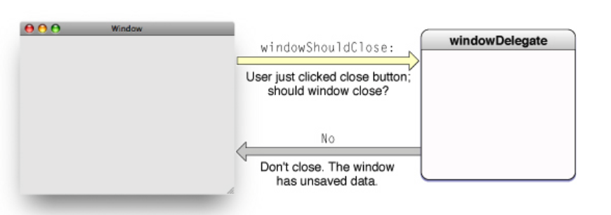
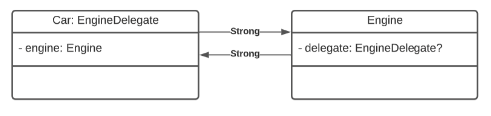
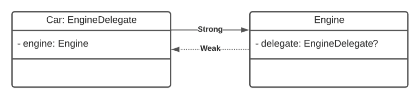

<a href="../../README.md">

</a>

## Definition
#### What is delegation and the delegate?

In short:
- delegation - is making something responsible for
- delegate - is responsible for something

In long:
- *Delegation* is a way of communication between 2 objects by one object notifying another object when an event occurs. it enables a class or a structure to hand off (or delegate) some of its responsibilities to an instance of another type
- The *delegating objet* keeps a reference to the other object - the delegate - and the appropriate time sends a message to it

Delegate can: 
- Update appearance or state of itself or any other object in application
- In some cases it can return a value that affects how event should be handled


#### When to use a delegate?
Delegate is valuable when our class needs to support multipe:
- use cases without having to account for all those use cases
- different contexts but has one clear owner in those contexts

#### Exploring delegate usages
***UITextField*** is one of the base UI elements on iOS that allows user to input text. ***UITextField*** class exposes ***UITextFieldDelegate*** that delegates responsibility of:
- Deciding to allow text input and keyboard presentation 
- Deciding to allow finishing text input
- Deciding what to do after editing finishes
- Allowing to clear the text
- Allowing to enter specific characters in text


***UIPickerView*** is one of the base UI elements on iOS that allows user to select from predetermined list of options. It exposes ***UIPickerViewDelegate*** that delegates responsibility of:
- Setting height and width of rows
- Settings titles of rows
- Handling selections
#### Example:

> The client reports a bug. The project manager creates an ssue and tells one of the developers to fix the problem asap.

That is [delegation](http://www.andrewcbancroft.com/2015/03/26/what-is-delegation-a-swift-developers-guide/). At some point an event happened, so the delegator (manager) utilized an external resource (a developer) using a common interface (issue describing the problem for both party) to do achieve something to fix a bug.

```Swift
import Foundation


protocol InputDelegate {

    var shouldContinueListening: Bool { get }

    func didStartListening()
    func didReceive(input: String)
}


class InputHandler {

    weak var delegate: InputDelegate?

    func listen() {
        self.delegate?.didStartListening()

        repeat {
            guard let input = readLine() else {
                continue
            }
            self.delegate?.didReceive(input: input)
        }
        while self.delegate?.shouldContinueListening ?? false
    }
}


struct InputReceiver: InputDelegate {

    var shouldContinueListening: Bool {
        return true
    }

    func didStartListening() {
        print("👻 Please be nice and say \"hi\", if you want to leave just tell me \"bye\":")
    }

    func didReceive(input: String) {
        switch input {
        case "hi":
            print("🌎 Hello world!")
        case "bye":
            print("👋 Bye!")
            exit(0)
        default:
            print("🔍 Command not found! Please try again:")
        }
    }
}

let inputHandler = InputHandler()
let inputReceiver = InputReceiver()
inputHandler.delegate = inputReceiver
inputHandler.listen()

```

#### Weak properties
All the class delegates, must be weak properties, otherwise the delegate will cause memory leak (won't close after the class delegating will be stopped)

```Swift
protocol InputDelegate: class { /*...*/ }

class InputHandler {

    weak var delegate: InputDelegate?

    /*...*/
}

class InputReceiver: InputDelegate {
    /*...*/
}
```
#### Another reason for delegate to be "weak" 

Swift uses Automatic Reference Counting (ARC) to track and manage app's memory usage. 

Memory management mostly works automatically with ARC freeing up memory when class instances are no longer needed.

Reference countring applies only to instances of *classes*. Structures and enumerations are **value types**, not **reference types**, and are not stored and passed by reference 

Whenever we assign a *class instance* to a *property, constant*, or *variable*, that *property*, *constant*, or *variable* makes a strong reference to the *instance*, increasing a reference count to 1.

While there's at least 1 *property*, *constant* or *variable* holding a strong reference to the instance, it is not **deallocated**

```Swift 
var engine1: Engine?
var engine2: Engine?
var engine3: Engine?

engine1 = Engine() // Reference count to Engine 1
engine2 = engine1  // Reference count to Engine 2
engine3 = engine1  // Reference count to Engine 3

engine1 = nil // Reference count to Engine 2
engine2 = nil // Reference count to Engine 1
engine3 = nil // deinitialized
```

If two instances hold a strong reference to **each other**, then a class **never** get to a point where it has zero strong references. Both instances keep each other alive. This is known as **strong reference cycle**.

Both instances wait for each other to be released indefinetly which creates a **memory leak**

```Swift
class Car: EngineDelegate {
    let engine = Engine()

    init() {
        engine.delegate = self
    }
}

protocol EngineDelegate: AnyObject {}

class Engine {
    var delegate: EngineDelegate?
}
```



If **instance A** holds a strong reference to **instance B** and then **instance B** holds a weak reference to **instance A**, then:
- **instance A** keeps **instance B** alive
- **instance B** does not keep **instance A** alive

```Swift
class Car: EngineDelegate {
    let engine = Engine()

    init() {
        engine.delegate = self
    }
}

protocol EngineDelegate: AnyObject {}

class Engine {
    weak var delegate: EngineDelegate?
}
```



#### Why delegate protocol is "AnyObject"
- *AnyObject* is the protocol to which all class types implicitly (without question) conform
- We would be able to make protocol *weak*, without protocol being *AnyObject*, as only class types can be weak

#### Difference between Data Source and Delegate
Technically there're identical.

*Delegate* is used to delegate control of **events** that are happening.

*Data source* is used to delegate control of managing and providing **data**

```Swift
class List {
    weak var delegate: ListDelegate?
    weak var dataSource: ListDataSource?
}

protocol ListDelegate: AnyObject {
    func listTapped(onRowAtIndex rowIndex: Int)
}

protocol ListDataSource: AnyObject {
    func numberOfRows() -> Int
}

```
### Protocols: 
```Swift
protocol FileImporterDelegate: AnyObject {
    func fileImporter(_ importer FileImporter,
        shouldImportFile file: File) -> Bool

    func fileImporter(_ importer FileImporter,
        didAbortWithError file: File) -> Bool

    func fileImporterDidFinish(
    	_ importer FileImporter
    )
}

class FileImporter {
    weak var delegate: FileImporterDelegate?
}

```

- To make it clear that a method is indeed a delegate method, it's common practice to start the method name with the name of the type that is delegating - like how every method above starts with <code>fileImporter</code>.
- A delegate method's first argument should ideally be the delegating object itself. That makes it easy for an object that owns multiple instances to distinguish between them when handling events.
- When delegating, it's important to not leak any *implementation details* to the delegate. For example, when handling a button tap, it might seem useful to pass the button itself to the delegate method - but if that button is a private subview it doesn't really belong in the public API.

The advantage of taking the protocol-based route is that it's an established pattern that most Swift developers are familiar with.

However, this approach also has some downsides. The most obvious one in our <code>FileImporter</code> example above, is that using delegate protocols can be a source of ambiguous state. Note how we are delegating the decision whether to import a given file to the delegate - but since assigning a delegate is optional, it can become a bit tricky to decide what to do if a delegate is absent:

```Swift
class FileImporter {
    weak var delegate: FileImporterDelegate?

    private func processFileIfNeeded(
    	_ file: File) {
        guard let delegate = delegate else {
            // Uhm.... what to do here?
            return
        }

        let shouldImport = delegate
        .fileImporter(self, 
        	shouldImportFile: file
        )

        guard shouldImport else {
            return
        }

        process(file)
    }
}
```
The above problem can be handled in many ways - including adding an <code>assertionFailure()</code> in the else clause when unwrapping the delegate, or using a default value. But either way it shows that we have somewhat of a weakness in our setup, since we are introducing another classic "*this should never happen*" scenario, which should ideally be avoided.

### Closures

One way that we can make the above code a bit more predictable is to refactor the decision-making part of our delegate protocol to use a closure instead. That way, our API user will be required to specify the logic used to decide which files that will be imported up-front, removing the ambiguity in our file importer's logic:

```Swift
class FileImporter {
    weak var delegate: FileImporterDelegate?
    private let predicate: (File) -> Bool

    init(predicate: @escaping (File) -> Bool) {
        self.predicate = predicate
    }

    private func processFileIfNeeded(_ file: File) {
        let shouldImport = predicate(file)

        guard shouldImport else {
            return
        }

        process(file)
    }
}
```

With the above change in place, we can now go ahead and remove the <code>shouldImportFile</code> method from out delegate protocol, leaving us with only methods related to changes in state:

```Swift
protocol FileImporterDelegate: AnyObject {
    func fileImporter(_ importer: FileImporter,
                      didAbortWithError error: Error)

    func fileImporterDidFinish(_ importer: FileImporter)
}
```

The main advantage of the above is that it now becomes much harder to use our <code>FileImporter</code> class "the wrong way", since it's now completely valid to use it without even assigning a delegate (which in this case might be useful in case some files should be imported in the background and we're not really interested in the outcome of the operation).

### Configuration types

Let's say we wanted to continue converting the rest of our delegate methods into closures as well. One way of doing so would be to simply continue adding closures as either initializer arguments or mutable properties. However, when doing so, our API can start becoming a bit messy - and it can be hard to distinguish between configuration options and other types of properties.

One way of solving that dilemma is to use a dedicated configuration type. By doing so we can achieve the same nice grouping of events, just like we had with our original delegate protocol, while still enabling a lot of freedom when implementing the various events. We'll use a <code>struct</code> for our configuration type and add properties for each event, like this:

```Swift
struct FileImporterConfiguration {
    var predicate: (File) -> Bool
    var errorHandler: (Error) -> Void
    var completionHandler: () -> Void
}
```
We can now update <code>FileImporter</code> to take a single parameter - its <code>configuration</code> - when being initialized, and easily access each closure by saving the configuration in a property:

```Swift 

class FileImporter {
    private let configuration: FileImporterConfiguration

    init(configuration: FileImporterConfiguration) {
        self.configuration = configuration
    }

    private func processFileIfNeeded(_ file: File) {
        let shouldImport = configuration.predicate(file)

        guard shouldImport else {
            return
        }

        process(file)
    }

    private func handle(_ error: Error) {
        configuration.errorHandler(error)
    }

    private func importDidFinish() {
        configuration.completionHandler()
    }
}
```
Using the above approach to delegation also comes with a nice bonus benefit - it becomes super easy to define convenience APIs for various common <code>FileImporter</code> configurations. For example, we can add a convenience initializer on <code>FileImportConfiguration</code> that only takes a predicate - making it simple to create a "fire and forget" type importer:

```Swift 
extension FileImporterConfiguration {
    init(predicate: @escaping (File) -> Bool) {
        self.predicate = predicate
        errorHandler = { _ in }
        completionHandler = {}
    }
}

```

> As a quick side note; by defining struct convenience initializers in extensions instead of on the type itself, we can still keep the default compiler-generated initializer.

We can even create static convenience APIs for common configurations that doesn't require any parameters, for example a variant that simply imports all files:

```Swift
extension FileImporterConfiguration {
    static var importAll: FileImporterConfiguration {
        return .init { _ in true }
    }
}
```

Which we can then use using Swift's really elegant dot syntax, making for an incredibly easy to use API, that still offers a lot of customization and flexibility:

```Swift 
let importer = FileImporter(configuration: .importAll)
```

--- 
Sources: [TheWiftDev](https://theswiftdev.com/swift-delegate-design-pattern/), [SwiftBySundell](https://www.swiftbysundell.com/articles/delegation-in-swift/)